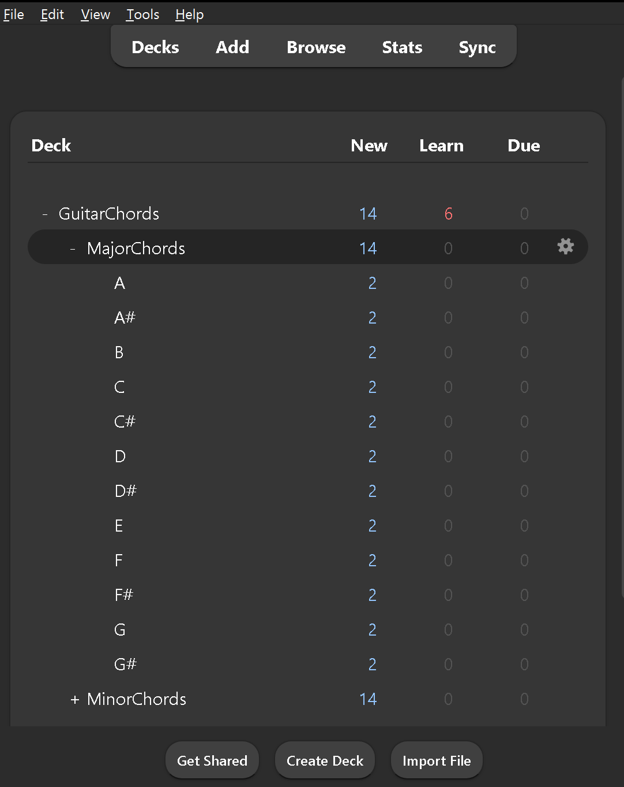
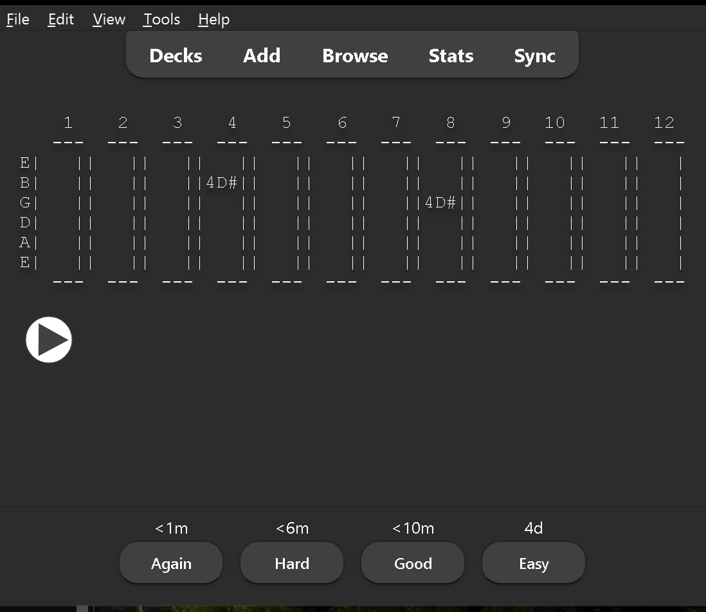
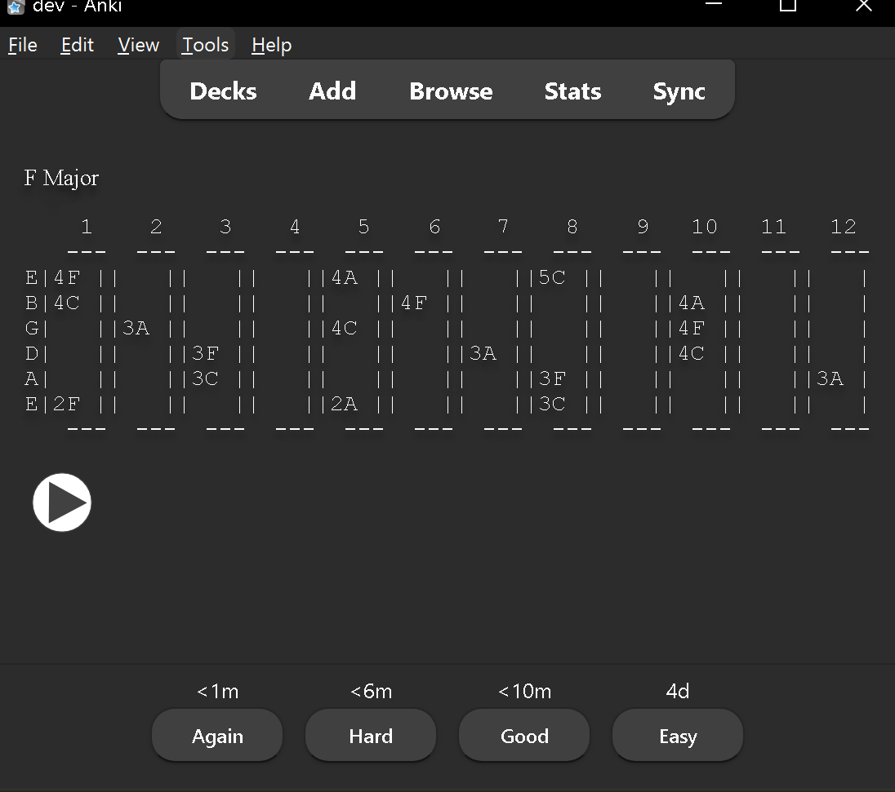

# Anki Flashcard for Guitar Chords

Each Note on Fretboard

Each Chord on Fretboard

# Download
You can download the Anki package directly in [GuitarChords.apkg](asset/GuitarChords.apkg).

# Note
Currently, only has Major and Minor chords for 12 notes, will add later.
